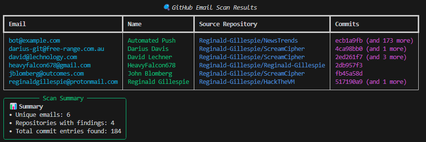

# GitSniff
GitSniff is an MIT licensed OSINT tool designed to extract emails from metadata on GitHub accounts and repos. 
I built this because all the other similar tools were too limited or broke years ago.


## Features
- Find emails in github repo metadata.
- Find emails from GitHub's user event feed
- Outputs results as a table or JSON

## Install
```bash
git clone https://github.com/Reginald-Gillespie/GitSniff
cd gitsniff
pip install -r requirements.txt
```

## Usage
```bash
# Scan a user.
python GitSniff.py -u <username>

# Scan a single repo.
python GitSniff.py -r <repo>

# Show full help pages.
python GitSniff.py -h
```



The email, `reginaldgillespie@protonmail.com`, is my email. The rest are the emails of other users found in my repositories because they contributed to them using their real emails.


### Full Help Page
```
$ python .\GitSniff.py -h
usage: GitSniff.py [-h] (-u USERNAME | -r OWNER/REPO) [--no-repos] [--no-events] [-f] [--private] [--max-commits N] [--start-index N] [--max-repos N] [--max-events N] [-t TOKEN] [--token-file FILE] [-p URL] [-j]

GitSniff - GitHub Email Scanner for OSINT

options:
  -h, --help            Show this help message and exit

Target Selection (required):
  -u, --user USERNAME   Scan GitHub user or organization
  -r, --repo OWNER/REPO
                        Scan single repository

Scanning Methods:
  --no-repos            Disable repository cloning scan
  --no-events           Disable public event API scan

Repository Options:
  -f, --forks           Include forked repositories
  --private             Include private repositories (requires token)
  --max-commits N       Max commits per repository (default: 1000)
  --start-index N       Start repo scan from index N (default: 0)
  --max-repos N         Maximum repositories to scan

Event Options:
  --max-events N        Max public events to scan (default: 1000)

Connection & Output:
  -t, --token TOKEN     GitHub personal access token
  --token-file FILE     Path to token file (default: pat.env)
  -p, --proxy URL       HTTP/SOCKS proxy URL
  -j, --json            Output in JSON format

Examples:
  GitSniff.py -u username                     # Scan user's repositories and events
  GitSniff.py -u username --no-events         # Scan only repositories
  GitSniff.py -u username --no-repos          # Scan only public events
  GitSniff.py -r owner/repo                   # Scan specific repository
  GitSniff.py -u username -f --max-repos 5    # Include forks, limit to 5 repos
  GitSniff.py -u username --private -t TOKEN  # Include private repos with token
```


---
<br>

This project was inspired by similar, but more limited projects such as:
- [GONZOsint/gitrecon](https://github.com/GONZOsint/gitrecon) - scans event feeds for information.
- [chm0dx/gitSome](https://github.com/chm0dx/gitSome) - scans single repositories.